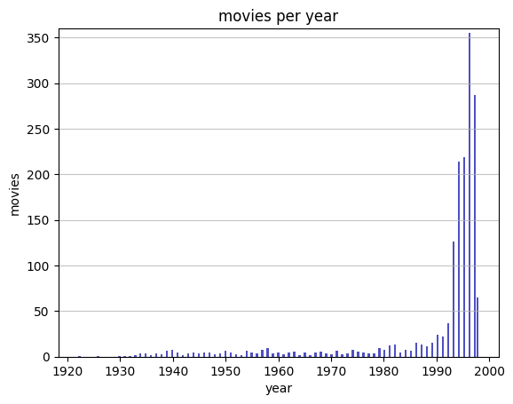
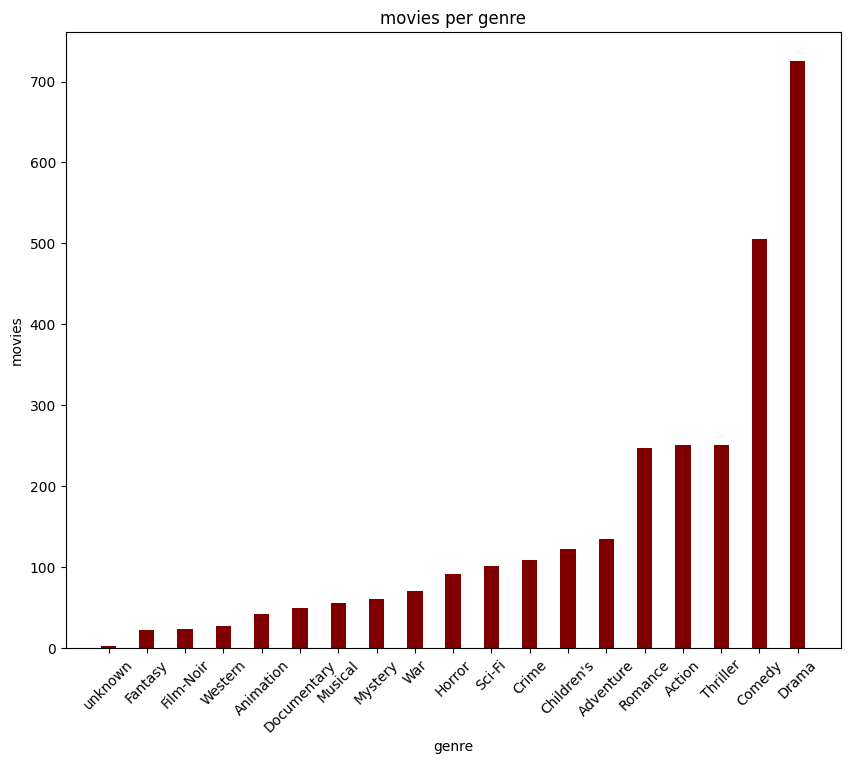
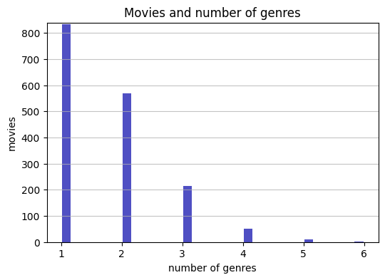
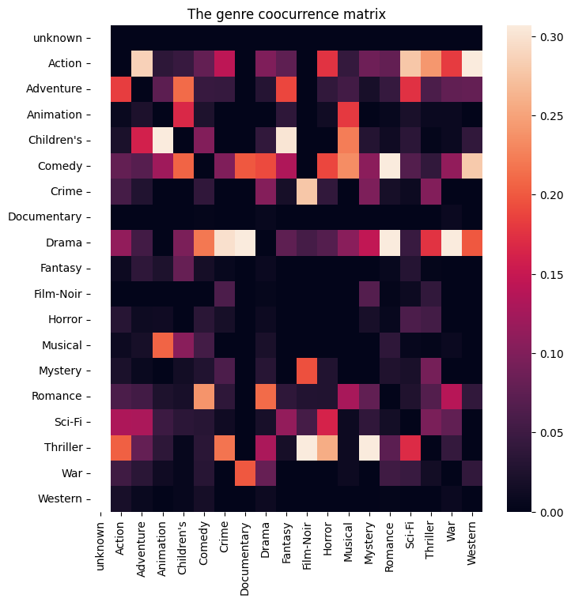

Ayhem Bouabid DS-BS-20
a.bouabid@innopolis.university

# Introduction

# Data analysis
## Movie Data
A movie is associated with 24 initial columns: id, title, link to the imdb page, the release data and 19 binary columns that represent different genres.

1. The title information might be quite misleading by itself. Completely movies can be assigned very similar weights. Thus, without further context such as description, or short movie summary this field might do more harm than good

2. The link to the imdb page is definitely helpful for data mining purposes. However, imdb is taking extra measures against web scraping making it quite difficult to extract information for all the entries in the dataset (it would be extremely suspicious for a human user to read about a movie released at 1995 just to check out a movie released in 1935 few minutes later). Thus, both these fields are dropped

3. The date is reduced to the year

4. We can see that the majority of movies were released between the year 1990 and 2000. The latter might lead to a bias towards more recent movies

5. A couple of interesting remarks can be made about the genre columns: 

1. Genre Inbalance: 

2. Sparsity: only $5\%$ of movies have more than $4$ genres:

A|B

 | 

The combination of these 2 figures suggests that Even though only 216 (please check the movie_data_analysis notebook for the code) combinations of genres out of $2^{19}$ possible combinations are present, the combinations are still diverse (we cannot reduce the)

Therefore, the interactions between the different genres are
    * too complex to be significantly improved with feature engineering
    * too sparse in consideration of the total number of features.

It is known that content-based recommendation systems offers several advantages such as nich recommendataions, scalability and simpliticiy. Nevertheless, the success of such an approach heavily depends on the quality of the item representations. In our case the item features are unlikely to be expressive enough.

# Model Implementation

# Model Advantages and Disadvantages

# Training Process

# Evaluation

# Results

